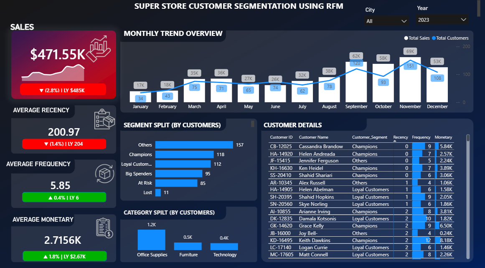

# 📊 Customer Segmentation using RFM Analysis

### Interactive Power BI Dashboard for Customer Behavior Analysis & Marketing Insights




---

# 📑 Table of Contents

- 📌 Overview
- 🎯 Project Objectives
- 🚀 Project Highlights
- 🛠️ Tech Stack
- 📂 Dataset
- 📊 Dashboard Preview
- ✨ Dashboard Features
- 🧮 RFM Analysis
- 👥 Customer Segmentation Rules
- 📈 Business Insights
- 🎯 Marketing Recommendations
- 🚀 Skills Demonstrated
- ▶️ How to Use
- 📁 Repository Structure
- 🚀 Future Enhancements
- 📄 License
- 👨‍💻 Author

---

# 📌 Overview

This project demonstrates **Customer Segmentation using RFM (Recency, Frequency, Monetary) Analysis** built entirely in **Microsoft Power BI**.

The dashboard analyzes customer purchasing behavior by calculating **Recency**, **Frequency**, and **Monetary** metrics to classify customers into meaningful segments. These insights help businesses improve customer retention, maximize customer lifetime value, and create targeted marketing strategies.

---

# 🎯 Project Objectives

- Clean and prepare transactional customer data
- Calculate **Recency, Frequency, and Monetary (RFM)** metrics
- Segment customers based on purchasing behavior
- Analyze customer behavior patterns
- Generate business insights
- Recommend targeted marketing strategies
- Build an interactive Power BI dashboard

---

# 🚀 Project Highlights

- 📊 Interactive Power BI Dashboard
- 🧮 Customer Segmentation using RFM Analysis
- 📈 Dynamic KPI Cards
- 📅 Monthly Sales & Customer Trend Analysis
- 👥 Customer Segment Distribution
- 📋 Customer-Level Analysis
- 🎛 Interactive Year & City Filters
- 💡 Business Insights & Marketing Recommendations

---

# 🛠️ Tech Stack

| Tool | Purpose |
|------|---------|
| Microsoft Power BI | Dashboard Development |
| Power Query | Data Cleaning & Transformation |
| DAX | RFM Calculations & Measures |
| Data Modeling | Relationship Management |

---

# 📂 Dataset

The project uses the **Superstore Sales Dataset**, containing transactional customer information such as:

- Customer ID
- Customer Name
- Order ID
- Order Date
- Sales
- Product Category
- City
- Region

---

# 📊 Dashboard Preview

## Main Dashboard


---

# ✨ Dashboard Features

## 📈 KPI Cards

- Total Sales
- Average Recency
- Average Frequency
- Average Monetary Value

---

## 📅 Monthly Trend Analysis

- Monthly Sales Trend
- Monthly Customer Count

---

## 👥 Customer Segmentation

Customers are categorized into:

- 🏆 Champions
- ⭐ Loyal Customers
- 💰 Big Spenders
- ⚠️ At Risk
- ❌ Lost
- 📦 Others

---

## 📊 Category Analysis

Customer distribution across:

- Office Supplies
- Furniture
- Technology

---

## 📋 Customer Details

Interactive customer table displaying:

- Customer ID
- Customer Name
- Customer Segment
- Recency
- Frequency
- Monetary Value

---

## 🎛 Interactive Filters

- Year Filter
- City Filter

---

# 🧮 RFM Analysis

### 🔹 Recency (R)

Measures how recently a customer made a purchase.

### 🔹 Frequency (F)

Measures how often a customer makes purchases.

### 🔹 Monetary (M)

Measures the total revenue generated by a customer.

---

# 👥 Customer Segmentation Rules

| Segment | Criteria |
|----------|----------|
| 🏆 Champions | R ≤ 2, F ≤ 2, M ≤ 2 |
| ⭐ Loyal Customers | R ≤ 3, F ≤ 2 |
| 💰 Big Spenders | R ≥ 3, M ≤ 2 |
| ⚠️ At Risk | R ≥ 3, F ≤ 3 |
| ❌ Lost | R = 5, F = 5, M = 5 |
| 📦 Others | Remaining Customers |

---

# 📈 Business Insights

- 🏆 Champions are the highest-value customers.
- ⭐ Loyal Customers contribute consistently to revenue.
- 💰 Big Spenders generate significant sales but require re-engagement.
- ⚠️ At Risk customers should receive retention campaigns.
- ❌ Lost customers should be targeted through win-back strategies.
- 📦 Office Supplies has the largest customer base.

---

# 🎯 Marketing Recommendations

| Customer Segment | Business Strategy |
|------------------|------------------|
| 🏆 Champions | VIP Rewards, Exclusive Offers, Early Product Access |
| ⭐ Loyal Customers | Loyalty Programs, Reward Points, Personalized Recommendations |
| 💰 Big Spenders | Premium Promotions, Personalized Discounts |
| ⚠️ At Risk | Retargeting Campaigns, Reminder Emails, Limited-Time Discounts |
| ❌ Lost | Win-back Campaigns, Customer Surveys, Special Offers |

---

# 🚀 Skills Demonstrated

- Data Cleaning using Power Query
- Data Modeling
- DAX Measures & Calculated Columns
- RFM Analysis
- Customer Segmentation
- Interactive Dashboard Design
- KPI Development
- Business Intelligence Reporting
- Business Insight Generation

---

# ▶️ How to Use

1. Download the `.pbix` file.
2. Open it using **Microsoft Power BI Desktop**.
3. Refresh the dataset if required.
4. Use the **Year** and **City** filters to explore the dashboard.
5. Analyze customer segments and business insights.

---

# 📁 Repository Structure

```text
Syntecxhub_Customer-Segmentation-using-RFM-Analysis/

│── dashboard.png
│── SUPERSTORE_CUSTOMER SEGMENTATION USING RFM.pbix
│── Superstore 2025.csv
│── DAX Used.docx
│── README.md
```

---

# 🚀 Future Enhancements

- Customer Lifetime Value (CLV) Analysis
- Profitability Analysis
- Regional Customer Insights
- Drill-through Customer Profiles
- Mobile Dashboard Optimization

---

# 📄 License

This project is licensed under the **MIT License**.

---

# ⭐ Support

If you found this project helpful, consider giving this repository a **⭐ Star** on GitHub.

---

# 👨‍💻 Author

## **Sai Deepak**

🎓 B.Tech – Computer Science & Engineering (Data Science)

📊 Aspiring Data Analyst

🛠 **Power BI | SQL | Python | Excel**

📌 **LinkedIn:** www.linkedin.com/in/ch-sai-deepak-5b5631344

---

<div align="center">

### ⭐ Thank you for visiting this repository!

**If you like this project, don't forget to give it a Star ⭐**

</div>
